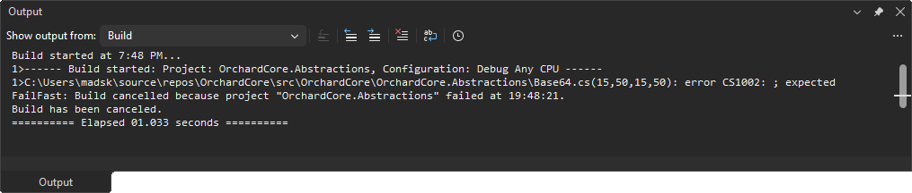
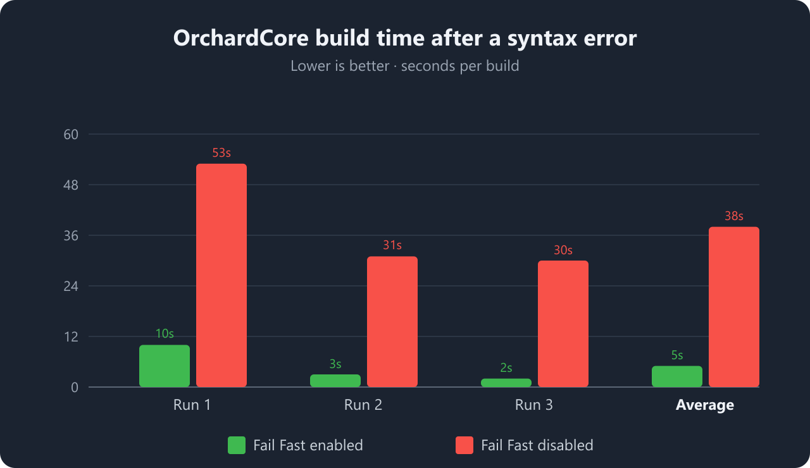
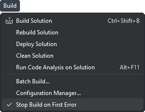

[marketplace]: <https://marketplace.visualstudio.com/items?itemName=MadsKristensen.FailFast>
[repo]: <https://github.com/madskristensen/FailFast>
[build]: <https://github.com/madskristensen/FailFast/actions/workflows/build.yaml>
[ci-build]: <https://www.vsixgallery.com/extension/FailFast.897947cf-5417-419c-9d8e-450b9480b07d>
[inspiration]: <https://marketplace.visualstudio.com/items?itemName=EinarEgilsson.StopOnFirstBuildError>

# Fail Fast for Visual Studio

[][ci-build]

Download this extension from the [Visual Studio Marketplace][marketplace] or grab the latest CI build from [VSIX Gallery][ci-build].

---

**Stop waiting on builds that have already failed.**

**Fail Fast skips projects that depend on a failed project.** Independent projects continue building, while projects that cannot succeed are never attempted.

> This extension was inspired by Einar Egilsson's [Stop on first build error][inspiration].

## The problem

You make a small change, hit build, and one project breaks early on. But Visual Studio keeps going - compiling dozens of downstream projects that depend on the broken one and can never succeed. You sit and wait, watching the output scroll, just to be told what you already knew seconds ago: the build failed.

In a large solution, that wasted wait happens on *every* failed build, dozens of times a day. It adds up fast.

**Fail Fast gives you that time back.** The moment a project fails, its dependants are skipped while independent projects continue building.

## Why use it?

- **Shorter feedback loops** - stop spending time on projects that cannot succeed after a dependency fails
- **Less output noise** - focus on the first real error instead of scrolling through follow-up failures
- **Built into Visual Studio** - toggle the behavior from the **Build** menu when you need it

## Real-world example

To see how much time this saves, I introduced a single syntax error in the **OrchardCore.Abstractions** project of the large [OrchardCore](https://github.com/OrchardCMS/OrchardCore) solution and built it three times with Fail Fast enabled and three times with it disabled.

<!--
| Run         | Fail Fast enabled | Fail Fast disabled |
| ----------- | ----------------: | -----------------: |
| 1           |               10s |                53s |
| 2           |                3s |                31s |
| 3           |                2s |                30s |
| **Average** |            **5s** |            **38s** |
/-->

Because OrchardCore.Abstractions sits near the bottom of the dependency graph, almost every other project depends on it. Without Fail Fast, Visual Studio keeps churning through projects that can never succeed. With Fail Fast enabled, those projects are skipped - roughly **7.6x faster** and about **33 seconds saved** per build in this case.

In a tight edit-build-fix loop, that difference adds up to minutes saved every hour. If you trigger 30 failed builds a day, that's around **15 minutes reclaimed daily** - on a single solution.

## Getting started

1. Install the extension from the [Visual Studio Marketplace][marketplace].
2. Open a solution with multiple projects.
3. Use **Build > Skip Build Dependants on Error** to enable or disable the feature.
4. Start a build as usual.
5. When a project fails, Fail Fast skips its dependants and continues building independent projects.

## What it does

- Watches solution builds in Visual Studio
- Skips projects that depend on a failed project
- Continues building projects that do not depend on the failure
- Only affects **Build** and **Rebuild** - **Clean** operations are never changed
- Writes a `FailFast:` message to the Build output pane when a project is skipped
- Remembers whether the feature is enabled

## Notes

- **Clean is never interrupted.** Fail Fast only reacts to build and rebuild operations, so a project that fails to clean (for example, when a COM unregistration step fails) will not affect the clean of other projects.
- The command is only shown when a solution with multiple projects is open.
- This extension targets Visual Studio 2022 on both amd64 and arm64.
- CI builds are available on [VSIX Gallery][ci-build], and publishing is handled by the [Build workflow][build].

## FAQ

### Does it slow down successful builds?
No. Fail Fast only acts when a project *fails*. A build that succeeds runs exactly as it normally would.

### Does it interrupt Clean operations?
No. Only **Build** and **Rebuild** are affected. A project that fails to clean (for example, a failed COM unregistration step) never affects the clean of other projects.

### Is the setting global or per-solution?
The enabled/disabled state is remembered globally and applies across solutions. Toggle it any time from **Build > Skip Build Dependants on Error**.

### How do I turn it off temporarily?
Use the **Build** menu to toggle it off, run your build, and toggle it back on when you're done. No restart required.

### Why don't I see the command?
The command only appears when a solution with multiple projects is open, since fail-fast behavior only matters for multi-project builds.

### Which versions of Visual Studio are supported?
Visual Studio 2022 (and newer) on both amd64 and arm64.

## How can I help?

If you enjoy using the extension, please give it a rating on the [Visual Studio Marketplace][marketplace].

If you run into a bug or have an idea for an improvement, open an issue in the [GitHub repo][repo].

Pull requests are welcome.
